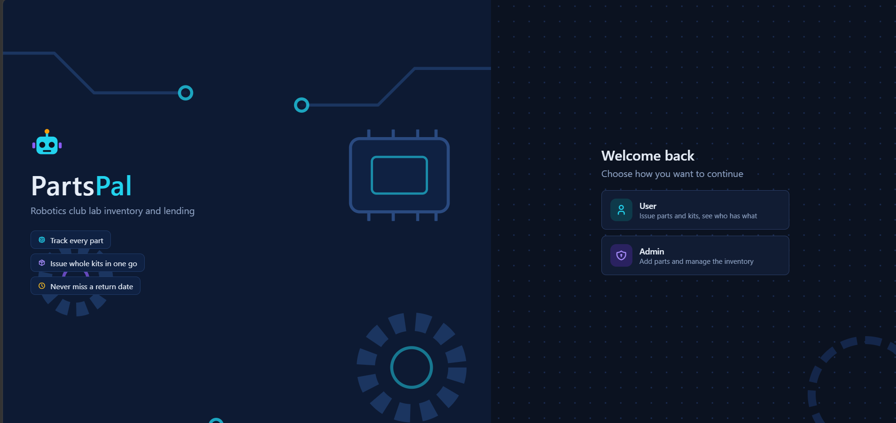
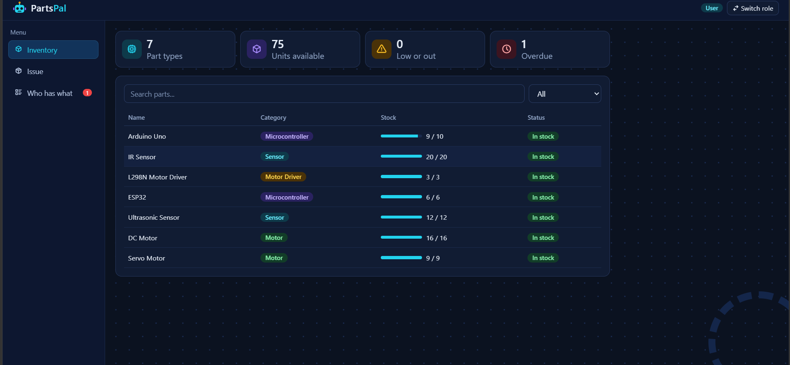
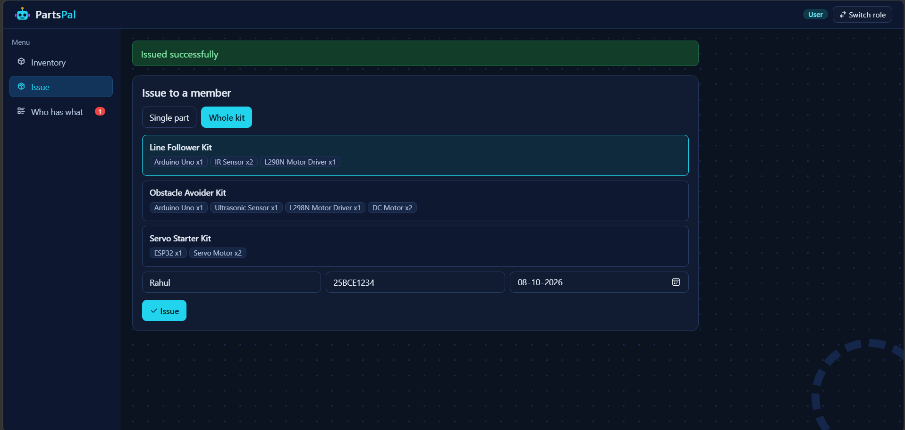
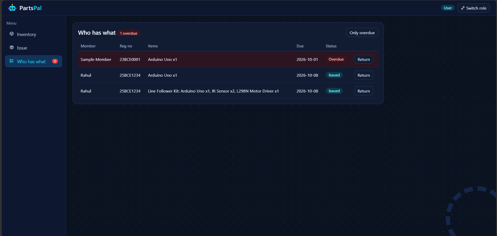

# PartsPal

A parts inventory and lending app for a robotics club lab. It tracks every part, shows who has borrowed what, and can issue a whole kit in one go.

Made by Khushi Banjan(25BCE1834) for Robotics Club VITC, Web Dev Round 2 (PS-05).

- App: https://parts-pal-seven.vercel.app/
- API server: https://partspal-server.onrender.com/
- Code: https://github.com/khushi-tech05/PartsPal

The server runs on Render's free plan, so the first load can take up to a minute. Data is kept in memory and resets when the server restarts.

## Screenshots

 
 

## Login

- User: no password
- Admin: `admin123`

## Features

- Inventory with total and available counts, search and category filter
- Issue a single part or a whole kit to a member with a due date
- Kits are checked on the server first. If any part is short, nothing is issued and the error names the part
- Return an issue to put its parts back in stock
- Overdue items are highlighted in "Who has what"
- Admins can add parts, and users can't (checked on the server)
- Works on a phone screen

## Run locally

Start the server:

```
cd server
npm install
node index.js
```

In a second terminal, start the frontend:

```
cd client
npm install
npm run dev
```

Open http://localhost:5173. The local admin password is `admin123`.

## How to use PartsPal

### 1. Select a role

Open the website and choose either:

- **User** — to view inventory and issue/return parts.
- **Admin** — to manage the inventory.

For the admin role, enter the admin password.

### 2. Check the inventory

The **Inventory** page shows:

- Part name
- Category
- Total quantity
- Available quantity

Use the search bar or category filter to quickly find a part.

### 3. Issue a part

To issue a single part:

1. Open **Issue Part**.
2. Select the member.
3. Select the part.
4. Enter the quantity.
5. Select a due date.
6. Confirm the issue.

The available quantity is updated automatically.

### 4. Issue a kit

To issue multiple parts together:

1. Open **Issue Kit**.
2. Select the member.
3. Select the required kit.
4. Choose a due date.
5. Confirm the issue.

PartsPal checks the availability of **all parts on the server before issuing the kit**. If even one part is unavailable, the entire issue is rejected and the unavailable part is shown.

### 5. Check who has parts

Open **Who Has What** to see which members currently have parts issued to them.

Overdue items are highlighted so they can be identified easily.

### 6. Return parts

When a member returns their issued parts:

1. Open **Who Has What**.
2. Find the member's issue.
3. Select the return option.
4. Confirm the return.

The returned parts are added back to the available inventory.

### 7. Add a new part — Admin only

Admins can add new parts to the inventory.

1. Log in as **Admin**.
2. Open the inventory management section.
3. Enter the part details and quantity.
4. Add the part.

User-side access is blocked on the server, so users cannot add parts by simply modifying the frontend.

## How I used AI

I used Claude as a development assistant to help me plan the project, understand concepts, break down tasks, and troubleshoot errors when I got stuck. However, I did not rely on Claude to build the project for me. I went through the code, understood how each part worked, made the required changes myself, and tested the features while developing. I also used Claude to help debug issues such as the API URL configuration on Vercel. All the code was written, run, tested, committed, and deployed by me.